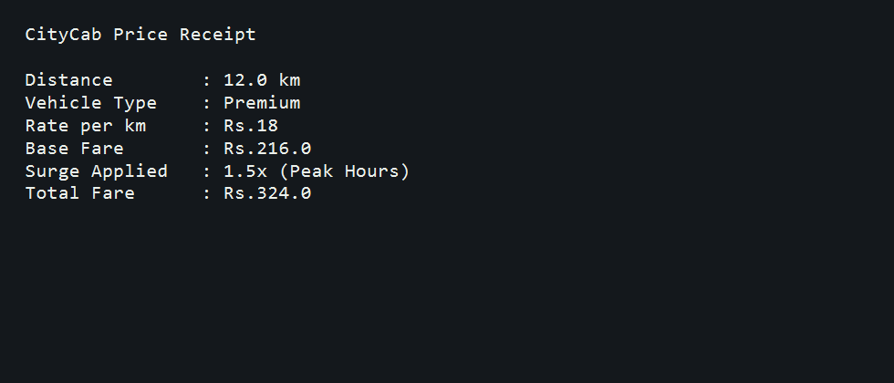

# CityCab Fare Calculator

## Overview

This Python mini project calculates cab fare based on travel distance, vehicle type, and peak-hour surge pricing.

## Features

- Supports multiple vehicle types
- Calculates fare based on per-kilometer rate
- Applies surge pricing during peak hours
- Handles invalid vehicle types and invalid input

## Tools Used

- Python
- Dictionary-based rate mapping
- Conditional logic
- Exception handling with `try` and `except`

## Screenshot

## Author

Suru Harshit
